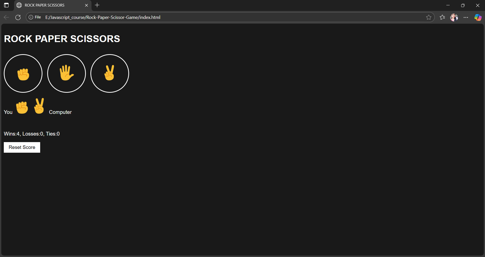

# 🎮 Rock-Paper-Scissors Game  

A simple Rock-Paper-Scissors game built using **HTML, CSS, and JavaScript**.  
This project was created as part of my JavaScript learning journey.  

## 🚀 Features  
- Play Rock, Paper, Scissors against the computer  
- Keeps track of **Wins, Losses, and Ties**  
- **Reset button** to clear the score  
- Simple and user-friendly interface  

## 🛠️ Technologies Used  
- **HTML** for structure  
- **CSS** for styling  
- **JavaScript** for game logic  

## 📷 Demo Screenshot  



## 📂 How to Run  
1. Clone the repository  
   ```bash
   git clone https://saisree1431.github.io/Rock-Paper-Scissor-Game/.git
